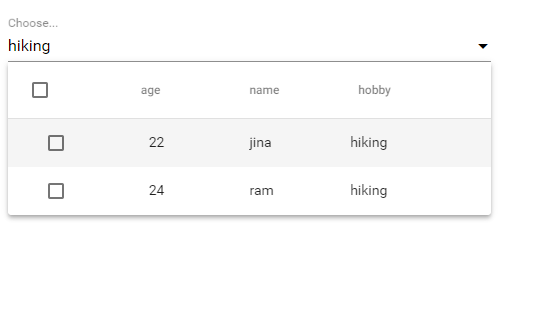

# Multi column select for angular material
A select input with multicolumn option display. Angular Material. Autocomplete. Two way value binding

Features:
- Autocomplete
- Multiselect
- Data binding

# Single select
 

# Multi select

# Search 
 

# Search any column

Author
------
Prabesh KC
